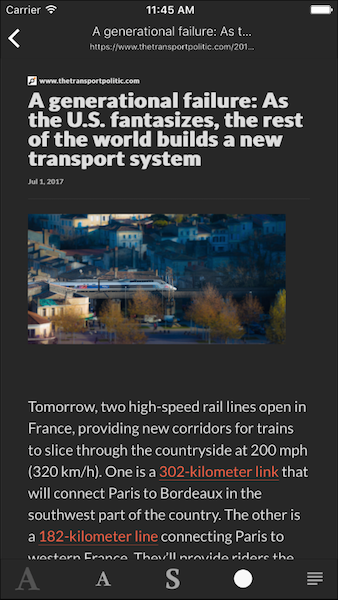

# SwiftyMercuryReady

<p align="center">
    <a href="https://travis-ci.org/tsucres/SwiftyMercuryReady">
      
    </a>
    
    <a href="https://opensource.org/licenses/MIT">
      
    </a>
</p>
<p align="center">
    >>> <a href="https://appetize.io/app/vqfyxz47vrkq5v2z0cpzq9bv04?device=iphonex&scale=75&orientation=portrait&osVersion=11.4" target="_blank"><strong>DEMO</strong></a> <<<
</p>


A MercuryApi based iOS reader written in Swift.
### Motivation
Most modern webbrowers (mobile or desktop) implement a "reader mode" allowing to sanitise/epurate the design of a webpage and offer a better reading experience. However, WKWebView doesn't. Which means that an iOS app can't, natively, load a webpage and switch to the reader mode without passing it to safari. This project aims to add this functionality to a WKWebView subclass.

## Presentation


#### Customisable font


You can easily switch between 3 **font sizes** and change between **serif/sans**


#### Lght & Dark themes



#### Foldable navigation bar


#### Navigation Back & Forward


## Description

The project basically contains 3 parts, each one adding something to the previous:

- MercuryApi: a MercuryApi client, composed of two classes: `MercuryApi` and `MercurtResponse`. They're used to communicate with the API and handle the data it sends back.
- ReaderWebView: a `WKWebView` subclass that loads the data received by the API in an HTML template. It supports Dark/Light themes and different font sizes.
- ArticleReaderController: It's a `UIViewConroller` subclass that implements the basic functionalities of a web browser with the ability to switch to "reader mode" on any page that is supported by MercuryApi. 


## Usage

### MercuryApi
First of all, you have to set you set your Mercury Api key. If you don't have one, you can get it for free [here](https://mercury.postlight.com/web-parser/).

1. create a `keys.plist` file at the root of the project (along with the `info.plist` file)
2. add a property called `mercuryApiKey`
3. put your api key as value to this property

Then, you just use `parseUrl` with the url of the webpage you want to make more readable as parameter. You will get a MercuryResponse that encapsulate all the attributes generated by the API. 

```swift
MercuryApi.shared.parseUrl(url: url.absoluteString, completion: {(resp) -> Void in
	if resp != nil {
		print(resp!.title)
	} 
})
```

See the [documentation](https://mercury.postlight.com/web-parser/) of the api for more info about them.

### ReaderWebView

You have to add the `ReaderWebView` instance in a view (as you would with a WKWebView). Then , you load a webpage with 

```swift
load(url: URL)
```

If the webpage is supported by the API (meaning it's able to parse it and extract the content out of it), the ReaderWebView will load the content in the html template and render the whole thing.

It's also possible to directly load a `MercuryResponse`: 

```swift
load(MercuryResponse resp: MercuryResponse)
```

Use the delegate's methods `contentDidLoad ` and `contentFailedToLoad ` to determine whether the content successfully loaded or not (see the following section about the delegate).


##### Apparence

You can play with the apparence of the reader with: 

```swift
	/// Available content sizes
    enum ReaderContentSize {
        case small
        case medium
        case large
    }
    /// Available themes
    enum ReaderContentTheme {
        case light
        case dark
    }
    
    /// Currently displayed theme
    var readerTheme: ReaderContentTheme
    /// Current size of the content
    var readerContentSize: ReaderContentSize
    /// Indicates whether to use a serif font or not
    var fontSerif: Bool
    
```

##### Delegate

You can implement the following methods to keep track of what's happening inside the reader:

```swift
/// Called when the user taps on a link inside the reader.
func navigationRequested(request:  URLRequest, navigationType: WKNavigationType)
/// Called when a MercuryResponse was successfully loaded in the reader
func contentDidLoad(reader: ReaderWebView, content: MercuryResponse)
/// Called when the reader failed to load a URL
func contentFailedToLoad(reader: ReaderWebView, url: URL?, content: MercuryResponse?)
/// Called when the template has been loaded in the reader webview
func readerInitialized(reader: ReaderWebView)
```


**Note**: Since the ReaderWebView inherits from WKWebView, you can, in theory, assign a WKNavigationDelegate to it. In practice though, since the webview is only used to load the reader's template, the methods of the delegate aren't really useful.

##### Demo

Check the [`ReaderWebViewDemo.swift`](SwiftyMercuryReady/ReaderWebViewDemo.swift) file for a quick example.


### ArticleReaderController

This part of the project is an example of implementation of the previous part. You can use it as is if it fits your needs or modify it as you want.

In short, it's a controller handling a `WKWebView` that has a `ReaderWebView` associated (meaning they will always show the same content). It implements a navigation bar and a toolbar presenting the basic webview controls (back, forward and refresh). 


For a basic usage, all you have to do is instantiate the `ArticleReaderController` and give it a URL. Al the rest is controlled by the user. 

You may find usefull to manually show/hide the reader, you can do that using the `isReaderEnabled` property.


Check the [`ArticlesReaderDemo.swift `](SwiftyMercuryReady/ArticlesReaderDemo.swift) file for an example.


## TODO

- customisable background color for the reader (add swift properties for the color of the dark & light themes instead of hardcoding them in the html template)
- better error handling in MercuryApi
